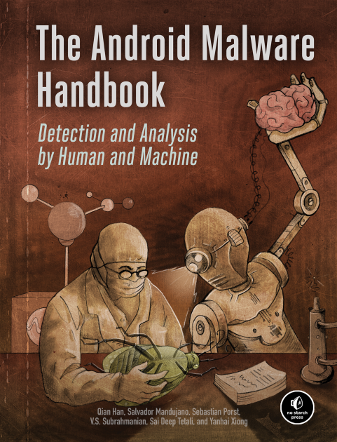

# The Android Malware Handbook

  

Welcome to the official GitHub repository of the Android Malware Handbook, a 2023 No Starch Press book about Android malware analysis and detection written by Qian Han, Salvador Mandujano, Sebastian Porst, V.S. Subrahmanian, Sai Deep Tetali, and Yanhai Xiong.

Book Websites: <a href="https://nostarch.com/androidmalwarehandbook">No Starch Press</a> - <a href="https://www.amazon.com/Android-Malware-Handbook-Detection-Analysis/dp/171850330X">Amazon</a>

## Website Content

This repository contains materials discussed in the book, for example real malware samples analyzed in the book and hashes for malware samples that we encourage readers to take a look at.

* [samples.md](samples.md): Hashes of all the malware samples referenced in the book.
* [ch3](ch3): Malware files discussed in the Static Analysis chapter.
* [ch4](ch4): Malware files discussed in the Dynamic Analysis chapter.

## Leave Feedback

* If you found an error in the book, the code, or this website, please file an [Issue](https://github.com/android-malware-ml-book/book-content/issues) for us to work on.